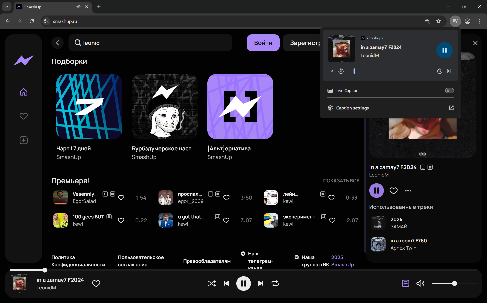
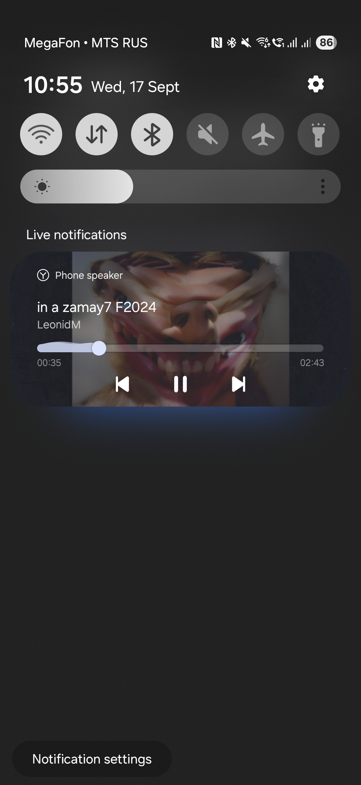

# @dmhd6219/react-media-session [](https://www.npmjs.com/package/@dmhd6219/react-media-session) [](https://github.com/dmhd6219/react-media-session/blob/main/LICENSE)

The React hook that wraps [Media Session API](https://developer.mozilla.org/en-US/docs/Web/API/Media_Session_API).

# Installation

```bash
npm install --save @dmhd6219/react-media-session
```

# Usage

```jsx
import { useMediaSession } from '@dmhd6219/react-media-session';

const Component = () => {
  // ...

  useMediaSession({
    title: 'in a zamay7 F2024',
    artist: 'LeonidM',
    album: 'LeonidM',
    artwork: [
      {
        src: 'https://api.smashup.ru/uploads/mashup/816_800x800.png',
        sizes: '256x256,384x384,512x512',
        type: 'image/jpeg',
      },
      {
        src: 'https://api.smashup.ru/uploads/mashup/816_100x100.png',
        sizes: '96x96,128x128,192x192',
        type: 'image/jpeg',
      },
    ],
    onPlay,
    onPause,
    onSeekBackward,
    onSeekForward,
    onPreviousTrack,
    onNextTrack,
  });

  // ...
};
```

# Screenshots

## Desktop


## Mobile


# Docs

Available content:
* `MEDIA_SESSION_SUPPORTED` constant
* `useMediaSession` hook

    props:
    ```
    {
        title?: string;
        artist?: string;
        album?: string;
        artwork: { src: string, sizes: string, type?: string }[];
        
        onNextTrack: function;
        onPause: function;
        onPlay: function;
        onPreviousTrack: function;
        onSeekBackward: function;
        onSeekForward: function;
        onSeekTo: function;
        onSkipAd: function;
        onStop: function;
    }
    ```
